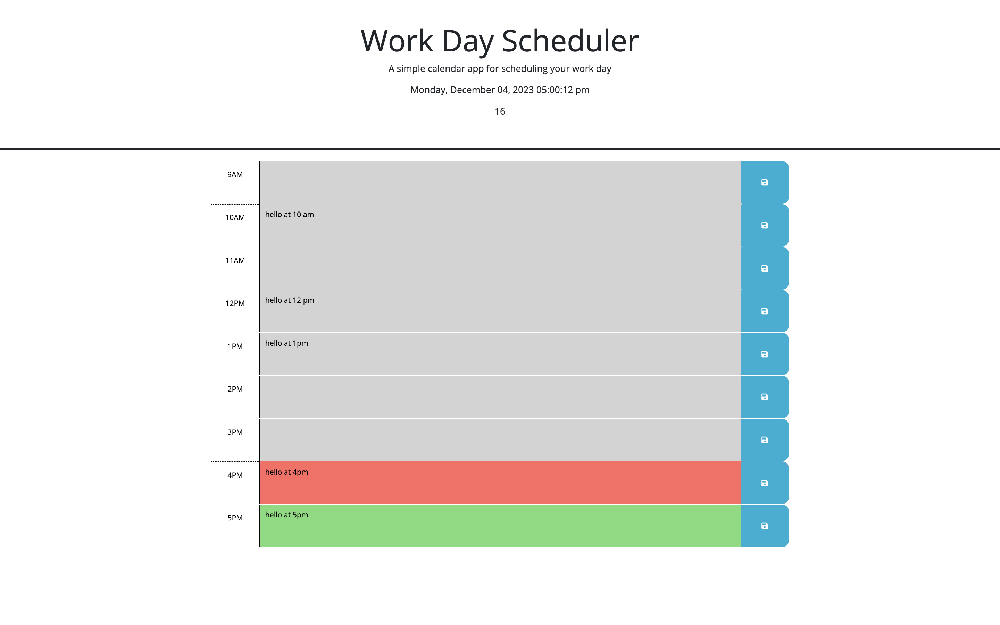

# workday-scheduler

A Workday Scheduler

## Description

This website is digital agenda where for people working from 9-5. It was made for busy workers who have many things to do during their workday. Users can type our their todo's and all items will be saved simply by clicking the save icon next to the hour block. Items will appear in page even if their page is refreshed. The scheduler will show green for future hours, red for the current hour, and grey for past hours. This scheduler may be used daily since it is updated every day.

## Installation

N/A

## Usage

To get started choose the hour in which you want to add an item. The current day appears at the header along with the current hour with seconds included for the conveniene of the user. Once you type an item that needs to be saved, click the save icon next to the hour block and the item will be saved. If you want to change an item simply delete by clicking and deleting with backspace or delete key. You will see current hour being displayed in red for every current hour. Once the hour has passed the block will turn grey. For items in future, these will be green.
Here is the link for full access https://judy-her.github.io/workday-scheduler/

## Credits

I had help from UCB Xpert Learning Assistant AI. It helped me fix my functions setLocalStorage() and getLocalStorage(), specifically in implementing 'this' correctly.

## License

Please refer to LICENSE in the repo.
